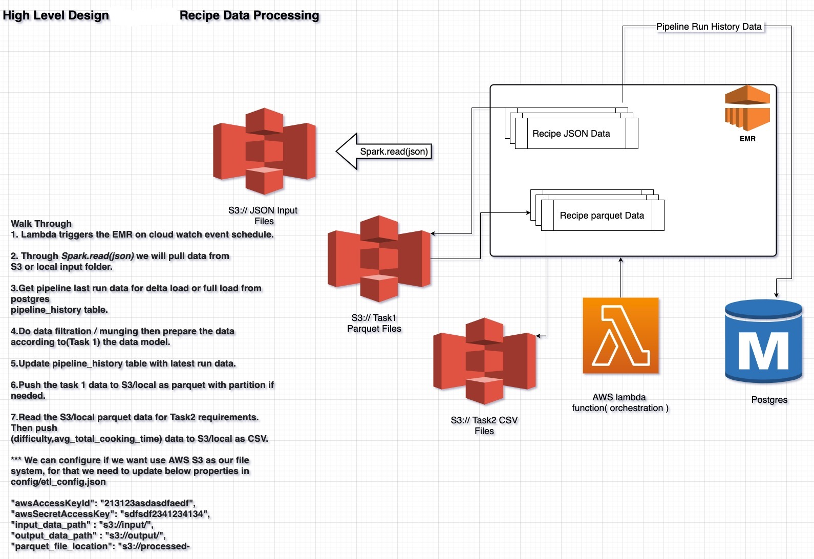

# recipes_pipeline 

This README is for HelloFresh recipes data pipeline explanation.

## High Level Design

## Explanation

Here I have made one assumption that data will be getting dumped in to input location daily wise.

So to process data incremental/Delta data I have decided to use a relational(postgres) history table `pipeline_history`
where I will persist max `datePublished(yyyy-mm-DD)` for each run. Such that next run I will load only delta data to parquet location.

Here I am reading data from `<project-root>/input` folder & dumping Task-2 CSV file to `<project-root>/output` directory.

## Steps for data processing

1. Lambda triggers the EMR on cloud watch event schedule.

2. Through Spark.read(json) we will pull data from 
S3 or local input folder.

3.Get pipeline last run data for delta load or full load from postgres
pipeline_history table.

4.Do data filtration / munging then prepare the data according to(Task 1) the data model.

5.Update pipeline_history table with latest run data.

6.Push the task 1 data to S3/local as parquet with partition if needed.

7.Read the S3/local parquet data for Task2 requirements. Then push
(difficulty,avg_total_cooking_time) data to S3/local as CSV.

*** We can configure if we want use AWS S3 as our file system, for that we need to update below properties in config/etl_config.json 

"awsAccessKeyId": "213123asdasdfaedf",
"awsSecretAccessKey": "sdfsdf2341234134",
"input_data_path" : "s3://input/",
"output_data_path" : "s3://output/",
"parquet_file_location": "s3://processed-data/recipe.parquet"